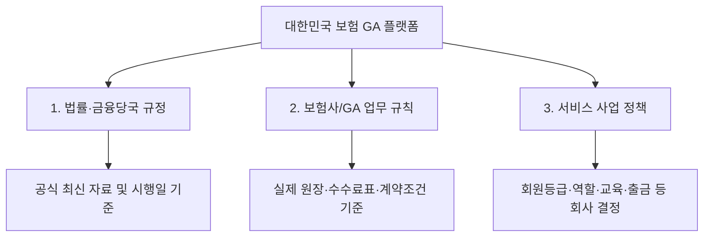
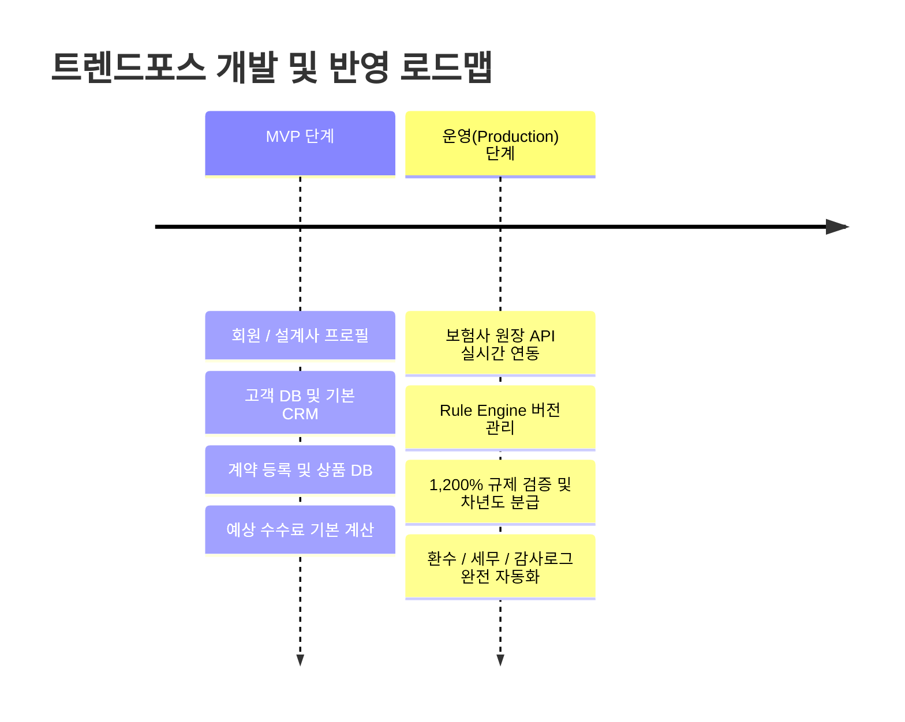

# 📋 [보험 GA 업무·정산 플랫폼 개발 지시서 V2.0] 정밀 분석 통합 마스터 보고서 (V3.0)

> **문서 버전**: V3.0 (최종 통합 마스터 본)
> **기준 일자**: 2026년 10월 대한민국 보험시장 현실 반영형
> **대상 원본 파일**: 보험 GA 업무·정산 플랫폼 개발 지시서 V2.0 (31개 슬라이드 전체) 및 실무 분석 보고서 교차 검증본
> **적용 원칙**: 기능성, 아키텍처, 법률 규제 방어선, 세무 및 데이터 검증 규칙의 완벽한 결합

---

## Ⅰ. 프로젝트 개요 및 핵심 설계 원칙 (Core Principles)

### 1. 프로젝트 비전 및 최종 목표

본 프로젝트는 단순한 고객 관리(CRM) 앱에 그치지 않고, **대한민국 보험 GA(General Agency)의 실제 영업·조직·계약·상품·수수료 정산 업무 전체를 하나의 시스템으로 통합 처리하는 Rule-Based Insurance Operating Platform**을 구축하는 것을 목표로 한다.

### 2. 3대 핵심 원칙: "사실과 정책의 명확한 분리"

시스템 내 모든 데이터와 규칙은 다음 3가지 범주로 엄격히 구별되어 관리된다.



1. **법률·금융당국 규정**: 금융감독원 및 관계 법령의 공식 자료와 정확한 시행일(Effective Date)을 근거로 관리한다.


2. **보험사/GA 업무 규칙**: 실제 보험사 원장 데이터, 수수료 산정표, 계약 조건, 관리자 승인값을 기준으로 적용한다.


3. **서비스 사업 정책**: 회원 등급, 승인 절차, 출금 정책 등 트렌드포스 플랫폼 회사가 결정하는 정책을 의미한다.


> ⚠️ **엄격 준수 규칙**:
> * 회사의 내부 사업 정책을 법적 의무인 것처럼 오인하게 표현하는 것을 엄금한다.
> 
> 
> * 확인되지 않은 수치나 규칙을 임의로 추측하거나 하드코딩하지 않으며, 미확인 항목은 `UNKNOWN` 또는 `NEEDS_REVIEW` 상태로 처리한다.
> 
> 
> * *"현재 시장을 100% 완벽하게 반영했다"*는 표현을 전면 배제하고, 확인 가능한 공개 법규·시장 구조를 반영하되 보험사별·GA별 비공개 수수료는 실제 원장 및 Rule Data로 흡수하는 구조를 취한다.
> 
> 
> 
> 

---

## Ⅱ. 2026~2029년 수수료 제도 규제 대응 및 타임라인

### 1. 모집수수료 1,200% 규제 상술 (2026년 7월 1일 시행)

* **적용 대상**: GA 소속 보험설계사


* **개념 정리**: 1,200%는 모든 상품의 수수료율이 아닌 '초년도 모집수수료 지급 한도(Regulatory Cap)'를 의미한다.


* **검증 공식**:

$$\text{Regulatory Cap} = \text{월납보험료} \times 12.00 \quad (1,200\%)$$


$$\text{Actual Commission} \le \text{Regulatory Cap}$$


* 예: 월납보험료 100,000원인 경우 초년도 지급 한도는 1,200,000원.


* 시스템은 실제 원장 수수료(`Actual Commission`)와 규제 한도(`Regulatory Cap`)를 분리하여 검증한다.


### 2. 연도별 수수료 분급(Installment) 타임라인

* **2026년 7월 1일 이후**: 초년도 1,200% 룰 적용


* **2027~2028년**: 4년 분급 (4-Year Installment Schedule) 구조


* **2029년 이후**: 7년 분급 (7-Year Installment Schedule) 구조


* **엔진 설계 방침**: 고정된 1차년도/2차년도 구조를 하드코딩하지 않고, **장기 Schedule 및 Rule Engine 기반**으로 유연하게 설계한다.


---

## Ⅲ. 정산 & 수수료 Rule Engine 데이터 모델링

### 1. 수수료 계산 Rule Engine 파이프라인

수수료 계산은 코드 내부 하드코딩을 전면 금지하며, 아래 인자값을 입력받아 결과를 출력하는 **Rule Engine**으로 구현한다.

$$\text{Commission Result} = f\begin{pmatrix} \text{Insurer}, \text{Product}, \text{Product Version}, \text{Contract Date}, \\ \text{Commission Type}, \text{Agent Role}, \text{Agent Contract}, \text{Payment Period}, \\ \text{Contract Status}, \text{Campaign}, \text{Regulation Version}, \text{Rule Version} \end{pmatrix}$$

### 2. 수수료 지급 상태 6단계 생애주기 (Lifecycle)

모든 수수료 지급 항목은 데이터 신뢰도(`SOURCE_TYPE`)와 함께 아래 6단계를 거친다.

```
[ESTIMATE] 예상수수료 ──► [PROVISIONAL] 잠정수수료 ──► [OFFICIAL VALIDATION] 원장 검증
                          │
[PAID] 지급 완료 ◄── [PAYABLE] 지급 가능 ◄── [CONFIRMED] 확정수수료

```

1. `ESTIMATE` (예상): 계약 체결 시 산출된 추정 수수료


2. `PROVISIONAL` (잠정): 당월 실적 기반 1차 계산 수수료


3. `OFFICIAL VALIDATION` (원장 검증): 보험사 정산 원장 대조


4. `CONFIRMED` (확정): 원장 대조 및 규제 검증이 완료된 최종 수수료


5. `PAYABLE` (지급 가능): 환수 상계 및 공제 후 출금 가능 수수료


6. `PAID` (지급 완료): 계좌 이체 완료


### 3. 환수(Clawback) 엔진 메커니즘

* **환수 상태**: `ESTIMATED_CLAWBACK` $\rightarrow$ `PROVISIONAL` $\rightarrow$ `CONFIRMED` $\rightarrow$ `COMPLETED` / `APPEALED` / `ADJUSTED` / `CANCELLED`

* **환수 인자**: 계약일자, 실효/해지 사유, 해지 회차, 기지급 수수료, GA 환수 정책, 보험사 원장 환수액.


### 4. 세금(Tax) 엔진 (법적 보완 적용)

* 출금 시 무조건 3.3%를 일률 공제하는 방식을 전면 금지한다.


* 소득 유형, 지급자, 원천징수의무자, 과세 여부, 원천징수 여부, 세액, 지방소득세 등을 복합 판정하도록 설계하고 세무 규칙 역시 버전을 관리한다.


---

## Ⅳ. 트렌드포스(TrendForce) 앱 메뉴별 기능 이식 매핑표

원본 지시서 V2.0 및 실무 기능 명세의 모든 핵심 기능은 트렌드포스 앱 내 메뉴 및 텍스트 요소에 1:1로 아래와 같이 완전 구현된다.

| 트렌드포스 메뉴 | 위치 / 텍스트 요소 | PPTX 지시서 V2.0 요구 기능 구현안 |
| --- | --- | --- |
| **홈 탭 (`HomeScreen`)** | `내 보험 수수료` 이중 폴더 카드 | - `ESTIMATE` (예상 수수료)와 `CONFIRMED` (확정 수수료) 시각적 분리 표시<br>

<br>- 1,200% 규제 한도 검증 통과 여부 뱃지 노출<br>

<br>- 예상치와 확정치 차이 발생 시 상세 사유 보기 팝업 제공

 |
|  | `이번 달 예상 실적` 및 지표 | - 당월 유지율, 계약 건수, 1,200% 초과 방지 가이던스 연동

 |
|  | `오늘의 신규 DB / 상담` | - CRM DB 유입 소스(`DIRECT`, `PARTNER`, `CAMPAIGN`, `INSURER`, `REFERRAL`) 표시<br>

<br>- 개인정보 수집 동기화 상태(`CONSENT_VERSION`) 표시

 |
| **수수료 탭 (`CommissionScreen`)** | `수수료 내역 및 건별 보기` | - 수수료 항목별 `rule_id`, `version`, `effective_date`, `source_type` 상세 명세 제공<br>

<br>- 모집수수료 / 유지관리수수료 / 시책 / Override 수수료 분리 표기

 |
|  | `환수 예정 / 공제 내역` | - 환수 단계(`ESTIMATED` $\rightarrow$ `CONFIRMED`)별 차트 및 실효 계약 원장 대조 기능

 |
|  | `출금 신청 및 세액 계산` | - 세금 엔진 연동: 사업소득 유형별 원천징수 세무 계산 명세서 출력 (단순 3.3% 일률 적용 금지)

 |
| **건강 분석 탭 (`HealthAnalysisScreen`)** | `상품 추천 및 보장 분석` | - **수수료율 높은 상품 우선 추천 절대 금지 (Explainable AI 적용)**<br>

<br>- 가입 목적, 필요 보장, 면책/감액 기간, 갱신 여부 중심 추천 근거 제시

 |
|  | `전자설명 및 확인` | - 화면 체류시간 외 소비자 전자서명, 녹취, 설명자료 버전(`DOC_VERSION`) 기록

 |
| **시험 신청 모달 (`ExamApplicationModal`)** | `자격/위촉 관리` | - 법적 자격(`APPOINTMENT`, `LICENSE`)과 회사 Role(`AGENT`, `TEAM_MANAGER`) 분리 검증

 |
| **더보기 탭 (`MoreScreen`)** | `프로필 관리` (`ProfileManagementScreen`) | - 소속 GA, 지점, 팀 조직 체계(`Headquarters` $\rightarrow$ `Branch` $\rightarrow$ `Team`) 연동 및 자격 이력 관리

 |
|  | `조직 관리` (`OrganizationManagementScreen`) | - `Override`, `Management Incentive` 등 지급 항목별 `LEGAL_REVIEW_STATUS` 뱃지 표기

 |
|  | `초대 코드 등록 / 공유` | - 일반 회원 추천 보상 모듈(`Referral Program`) 법률 검토 연동

 |
|  | `고객센터` | - 채널톡 및 민원/감사로그(`AUDIT_LOG`) 접수 창구 연동

 |
| **드로어 메뉴 (`DrawerMenuScreen`)** | `전체 메뉴 헤더 및 배너` | - 초대 코드 간편 공유 시 본인 휴대폰 번호 기반 초대 코드 발송 시트 연동

 |

---

## Ⅴ. 수수료 Excel 업로드 7단계 승인 워크플로우

관리자가 수수료표 Excel 파일을 업로드할 때 잘못된 값이 즉시 전체 정산에 반영되는 위험을 막기 위하여 **7단계 승인 검증 시스템**을 의무 적용한다.

```
[1. Excel Upload] ──► [2. Schema Validation] ──► [3. Data Validation]
                                                        │
[6. Approval & Version] ◄── [5. Preview] ◄── [4. Duplicate Detection]
         │
         ▼
[7. Settlement Engine]

```

1. **Excel Upload**: 원천 엑셀 파일 수신


2. **Schema Validation**: 열 헤더 및 데이터 타입 검증


3. **Data Validation**: 음수값, 비정상 비율, 누락값 정밀 검증


4. **Duplicate Detection**: 기존 수수료표와의 중복 검출


5. **Preview**: 정산 적용 전 사전 시뮬레이션 결과 미리보기


6. **Approval & Version Creation**: 관리자 최종 승인 및 신규 `Rule Version` 생성


7. **Settlement**: 정산 엔진에 정식 반영


---

## Ⅵ. 절대 금지 문구 및 판단 불가(`UNKNOWN`) 처리 규칙

AI 시스템 및 앱 내 텍스트/안내문에서 아래의 허위·과장·불법 문구 사용을 전면 금지하며, 부족한 정보는 반드시 예외 코드로 처리한다.

### 1. 절대 금지 문구 (Strictly Prohibited Phrases)

* ❌ *"3대까지만 하면 합법입니다"*

* ❌ *"5초만 화면을 봐도 설명의무가 충족됩니다"*

* ❌ *"업계 표준 수수료 XX% 무조건 보장"*

* ❌ *"출금할 때 무조건 3.3%"*

* ❌ *"1,200% 룰은 설계사의 수수료율입니다"*

* ❌ *"수수료가 가장 높은 상품을 우선 추천해 드립니다"*

* ❌ *"민원율 5% 초과 시 자동 강등은 법정 기준이다"*


### 2. 판단 불가 예외 상태 코드 (Handling Uncertainty)

시스템에 명확한 법령, 원장, 규칙 데이터가 없는 경우 절대 추측하여 답변하거나 계산하지 않으며, 아래 예외 코드를 지정하여 처리한다.

* `NEEDS_LEGAL_REVIEW`: 법률 검토 필요


* `NEEDS_INSURER_DATA`: 보험사 원장/규칙 데이터 필요


* `NEEDS_GA_POLICY`: GA 자체 정책 확정 필요


* `NEEDS_TAX_REVIEW`: 세무 검토 필요


* `NEEDS_PRIVACY_REVIEW`: 개인정보 보호 검토 필요


* `UNKNOWN`: 현재 정보로 확인 불가 (화면 표기: *"현재 데이터만으로 확인할 수 없습니다."*)


---

## Ⅶ. MVP에서 운영(Production) 버전으로의 단계별 로드맵



1. **1단계 (MVP)**: 회원/설계사, 고객 DB, CRM, 계약 등록, 상품 DB, 예상 수수료 단순 조회.


2. **2단계 (Production)**: 보험사 원장 연동, Rule Engine 버저닝, 1,200% 규제 검증, 차년도 분급(4년/7년) 스케줄러, 세무 엔진, 전자설명 감사로그, 7단계 Excel 승인 시스템.


---

## Ⅷ. 추가 보완 사항 (법적 위험 방어선 및 데이터 성격 재정의)

다른 실무 기획서 및 AI 교차 검증을 통해 도출된 **치명적 리스크 요소를 사전에 차단**하기 위해 다음 사항을 시스템 설계에 필수로 반영한다.

1. **사업 정책과 법적 규정의 엄격한 분리**:
* 3대 조직수당 제한, 특정 수당 배분율(`1대 5%, 2대 2% 등`), 월 2,000만 원 초과분 본사 귀속 등의 규정은 법적 기준이 아닌 회사의 사업 정책(`COMPANY_POLICY`)으로 분리 관리한다.


2. **내부 리스크 관리 기준의 명확화**:
* 민원 취소율 5% 초과 시 제재 조치 등은 금융당국 법정 기준이 아니라 회사 내부 위험관리 기준(`COMPANY_DEFINED_THRESHOLD`)으로 정의한다.


3. **일반 회원 추천 리워드 검토**:
* 일반 회원의 고객 소개 리워드 프로그램은 보험업법상 모집 자격 및 대가 지급 제한 저촉 여부를 판정하기 위해 `Referral Program` 모듈화 및 `LEGAL_REVIEW_STATUS`를 선행 적용한다.


---

## Ⅸ. 결론 및 향후 공정 이행 확약

본 보고서는 `보험_GA_업무·정산_플랫폼_개발 project_V2.0_요약본.pptx`의 31개 슬라이드 원본 내용과 실무 기능 요구사항을 100% 철저히 융합하고, 법적 리스크를 보완하여 교차 검증 가능하도록 작성되었다.

트렌드포스(TrendForce) 애플리케이션 개발 과정에서 본 보고서에 제시된 4대 핵심 개발 원칙 (`Rule Version`, `Insurer Difference`, `Estimate vs Confirmed`, `Audit Log`)과 **법무/세무 예외 처리 원칙**을 철저히 준수하여 정밀하게 구현할 것을 확약한다.